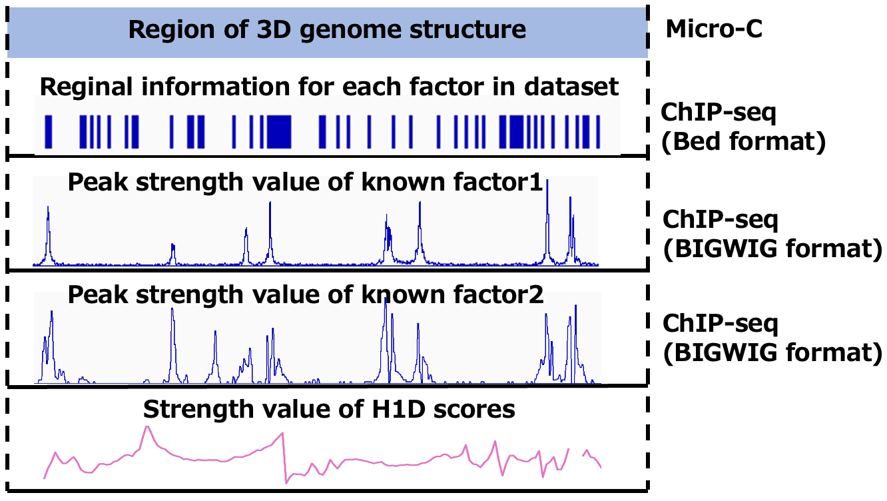
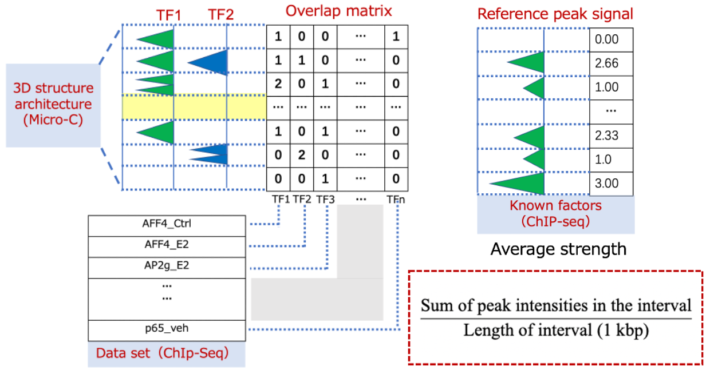
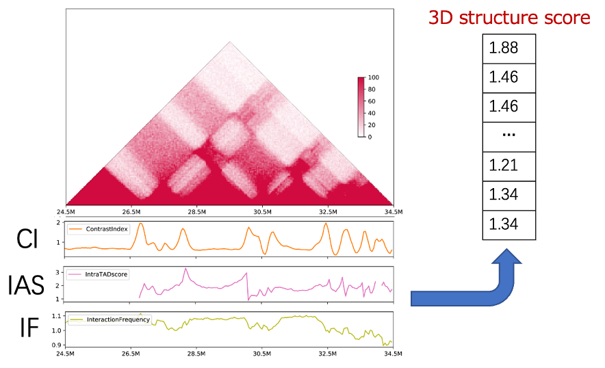
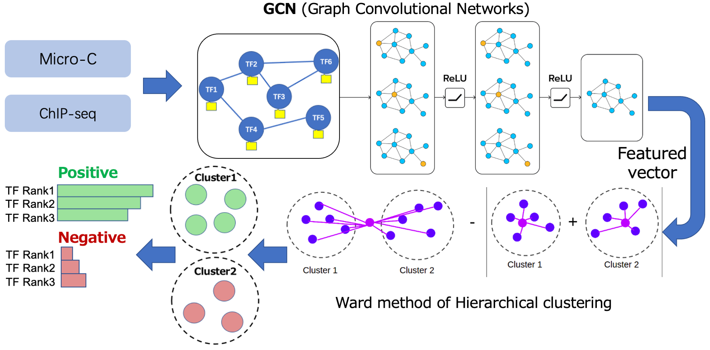
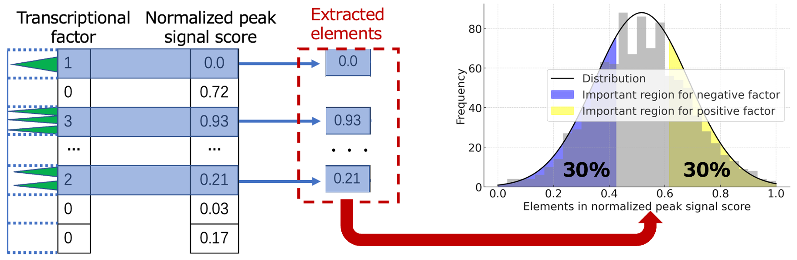

# A-graph-clustering-analysis-to-explore-correlated-factors-for-3D-genome-architecture

# Introduction

The three-dimensional (3D) chromatin architectures are crucial for cellular functions, with dysregulation linked to various diseases, including cancer. The regulation of 3D genomic architectures involves a complex interplay of factors, where traditional markers like cohesin, CTCF, and ZNF143 play established roles in the formation of Topologically Associating Domains (TADs) (Stilianoudakis et al., Bioinformatics, 2022). Recent advancements have identified new structural features—chromatin hubs, stripes, and subcompartments—indicating a broader regulatory landscape. Our study focuses on leveraging computational methods to explore this extensive range of regulatory elements, aiming to deepen the understanding of 3D genomic architecture regulation.

# Methodology

Workflow Overview
Our research strategy, incorporates advanced computational methods to systematically investigate the regulatory factors influencing 3D genomic architecture. The methodology consists of several key steps:

1.Data Collection: We utilized Micro-C data from human MCF7 cells, focusing on TAD boundaries, chromatin hubs, and stripes to capture essential features of 3D genomic architecture.

2.Overlap Matrix Construction: An Overlap Matrix was constructed to quantify the enrichment of transcription factors (identified via ChIP-seq) within the 3D chromatin structure. This matrix facilitates the analysis by representing specific intervals (rows) and corresponding factors (columns).

3.Signal Vector Aggregation: We aggregated average changes in peak intensity for key factors known to impact 3D chromatin structure (e.g., CTCF and cohesin) into a peak signal vector, enabling a focused analysis of their roles.

4.1D Score Extraction: Employing HiC1Dmetrix, we extracted one-dimensional (1D) scores associated with each 3D chromatin structure, forming a 1D score vector to enhance the model's comprehension of chromatin architecture.

5.Feature Engineering: To delineate associations between factors, we introduced cosine similarity and Manhattan distance as engineering features. These features were utilized to construct a network graph mapping the interactions among various factors.

6.Graph Convolutional Network (GCN) Utilization: The network graph, with nodes representing factors and connections defined by cosine similarity, employed GCN for node embedding.
Hierarchical Clustering: We performed hierarchical clustering to obtain clusters of similar factors, which were split into named positive and negative groups.

7.Key Region Identification: Focusing on essential factors within the 3D chromatin structure, we examined the distribution of peaks to identify key genomic regions, augmenting our understanding of pivotal roles these factors may play.

